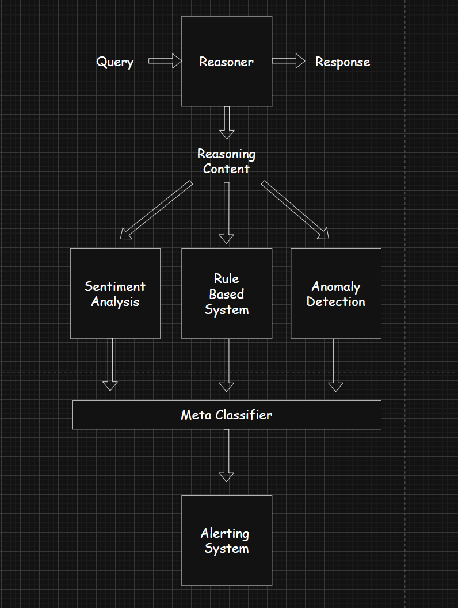

<p align="center">
  
</p>


<div align="center">

  <b>Model Probe</b>
----------------------
  a model probe for reasoners

</div>

<p align="center">
  <a href="https://opensource.org/license/0bsd">
    
  </a>
</p>

## About

## Architecture

The architecture of the model probe is designed to be modular and adaptable, making it easily generalizable across different reasoning systems.

The core workflow can be summarized by the following high-level diagram:

<p align="center">
  
</p>

The system takes a user query and extracts the model’s internal reasoning content. This reasoning is then fed into three parallel checks: **sentiment analysis**, **rule-based checks**, and **anomaly detection**. The outputs of these checks are aggregated by a **meta-classifier** that assigns an overall concern level. Finally, if certain thresholds are exceeded, the system triggers alerts, ensuring that any potentially problematic or anomalous reasoning is flagged for review.

The rule-based system provides explainable, deterministic detection that complements the more statistical approaches in other parts of the system, forming an essential component of the defense-in-depth strategy for monitoring AI reasoning. It serves as the policy enforcement layer, scanning AI reasoning content for predefined keywords that may indicate harmful, illegal, or manipulative content. Words are categorized by severity level, allowing for nuanced analysis rather than binary detection.

The sentiment analysis sytem adds an emotional intelligence layer that can detect concerning tone and affect that might not be captured by specific keywords, providing a window into the affective characteristics of AI reasoning. The system examines sentiment at both the document level and sentence level. Special emphasis is placed on identifying negative sentiment, which may indicate concerning reasoning patterns. Sentiment scores are mapped to concern levels based on empirically determined thresholds.

The anomaly detection system serves as the pattern recognition backbone of the model probe, identifying unusual reasoning that might not trigger explicit rules or sentiment flags but still deviates from established norms. The system employs an **Isolation Forest** to identify anomalies in reasoning behavior. While the system may initially appear to be stateless due to its functional pipeline architecture, it actually maintains significant state through two key mechanisms: **Persistent Embeddings Cache** and **Temporal Context**. This enables the system to preserve historical embeddings of reasoning patterns over time, allowing the anomaly detection system to learn and adapt as it processes more instances of reasoning content.

The meta-classifier serves as the decision-making brain of the model probe, synthesizing diverse signals into a unified assessment and actionable classification. It combines outputs from sentiment analysis, rule-based detection, and anomaly detection with appropriate weighting to reflect their relative importance to produce an aggregated result that is gated against carefully calibrated thresholds to map numerical scores to meaningful classification categories. This approach balances **sensitivity** with **specificity**, providing a reliable foundation for the alerting system that follows.

The alerting system forms the action layer of the model probe, incorporating tiered alert levels, complete context inclusion, and permanent audit trail to transform analytical insights into timely notifications for human review when necessary.


## Installation

1. Download [Ollama](https://ollama.com/download).
   
2. Verify that Ollama is working.
   
```
ollama --version
```

3. Download a DeepSeek model of suitable size.

```
ollama pull deepseek-r1:8b
```

4. Initialize the model locally.

```
ollama run deepseek-r1:8b
```

5. Install the following dependencies.

```
pip install ollama nltk sentence-transformers scikit-learn
```

6. Run `script.py`.

```
python script.py "your-prompt-here"
```

## Notes

## Meta

Aritra Ghosh – aritraghosh543@gmail.com

Distributed under the MIT license. See `LICENSE` for more information.

[https://github.com/arighosh05/](https://github.com/arighosh05/)

## Contributing

1. Fork it (<https://github.com/arighosh05/model-probe/fork>)
2. Create your feature branch (`git checkout -b feature/fooBar`)
3. Commit your changes (`git commit -am 'Add some fooBar'`)
4. Push to the branch (`git push origin feature/fooBar`)
5. Create a new Pull Request
